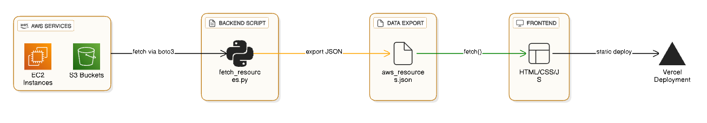

# Architecture & workflow

This project follows a simple but production-inspired workflow, where **AWS** resources are fetched using **Python + AWS CLI** and the final dashboard is powered by a static **JSON** file.

The architecture is divided into two major layers:

### 1. Backend (Python + AWS CLI)

The backend is responsible for:

- Authenticating using AWS CLI credentials
- Fetching EC2 Instances
- Fetching S3 Buckets
- Converting raw AWS data into clean JSON
- Exporting the file into the frontend folder

Flow:

AWS CLI Credentials → 
boto3 (Python) → 
fetch_resources.py → 
AWS API → 
JSON Export

Output

`frontend/public/data/aws_resources.json`

This JSON file becomes the single source of truth for the dashboard.

### 2. Frontend (Static HTML/CSS/JS)

The frontend:

- Uses HTML + CSS + Vanilla JavaScript
- Loads JSON via:
- fetch("data/aws_resources.json")

Renders:

- EC2 instance count
- S3 bucket count
- Table-based resource breakdown
- Runs locally or on Vercel without any backend server

Flow:
aws_resources.json → 
fetch() → 
DOM Update → 
Dashboard UI

### 3. Deployment (Vercel)

The frontend is deployed on Vercel because:

- It’s static (HTML/CSS/JS)
- No backend server is needed
- Instant redeploys when JSON updates

Flow:
git push → 
Vercel builds → 
Live dashboard refreshes

