# Screenshots

**01-AWS-CLI-INSTALLED**

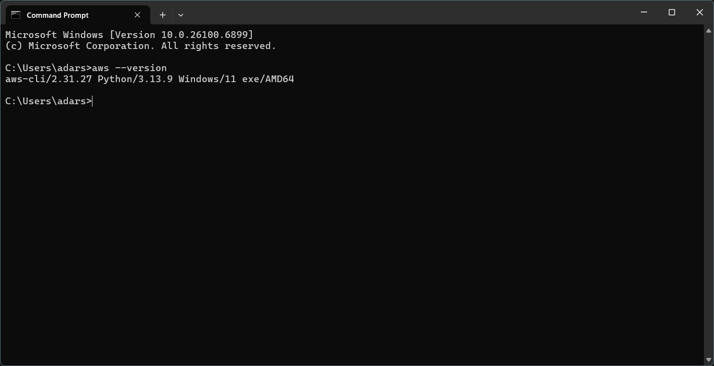

**02-IAM-User-Creation-Name**

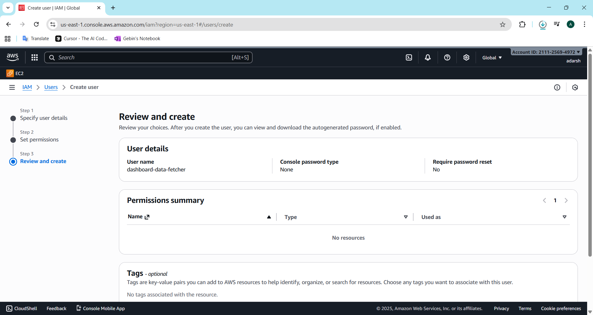

**03-IAM-User-Policies**

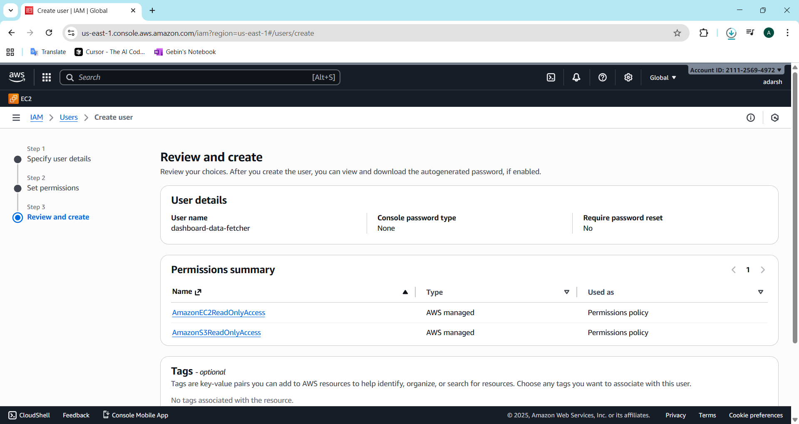

**04-IAM-AccessKey-Created**

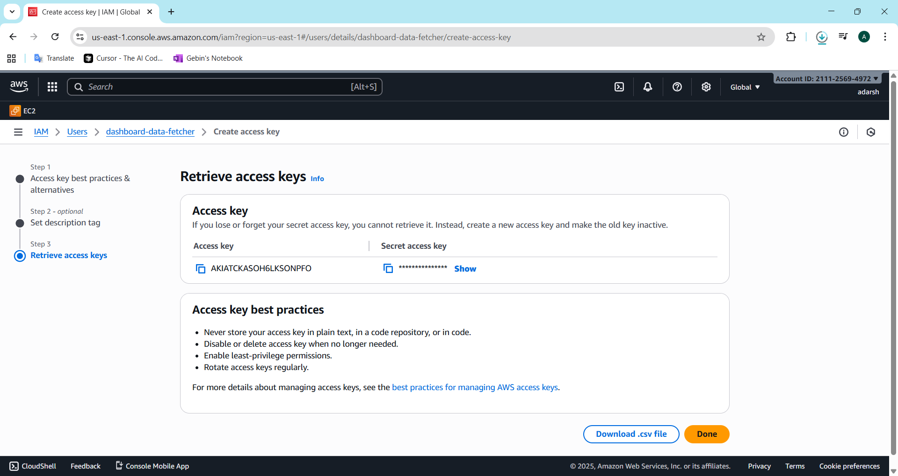

**05-AWS-CLI-Configured**

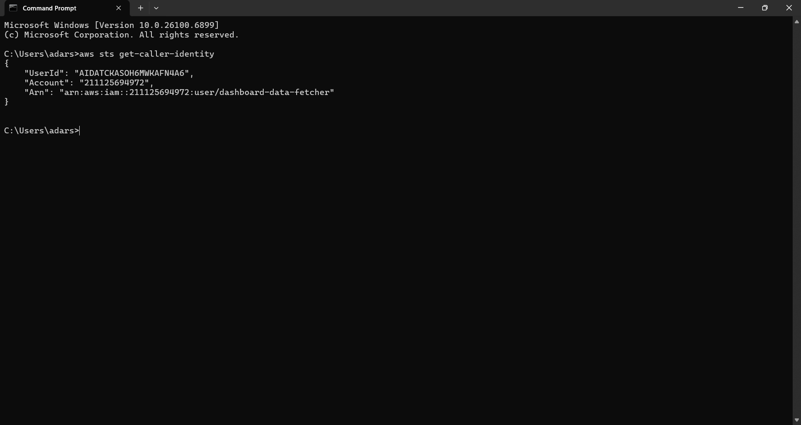

**06-EC2-Launch-Page**

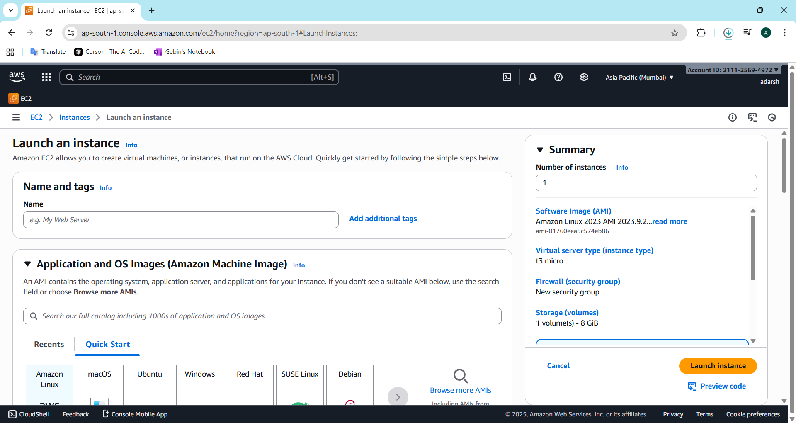

**07-EC2-Configuration**

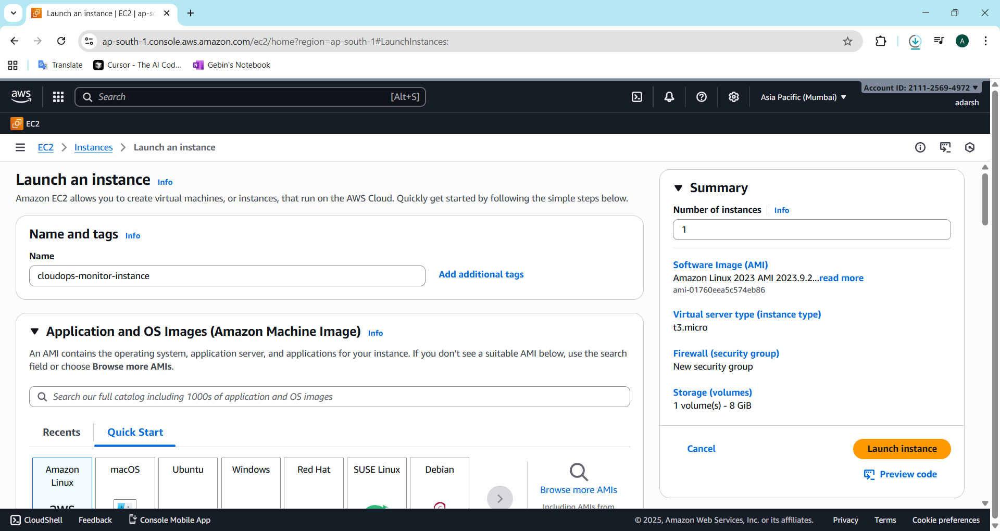

**08-EC2-Running**

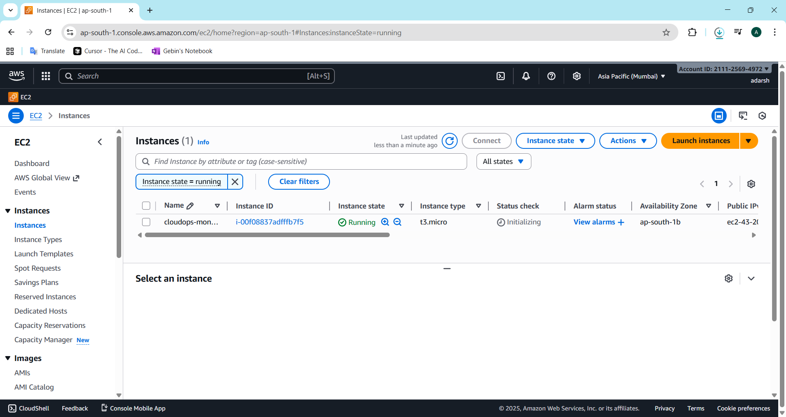

**09-EC2-Describe-Instances**

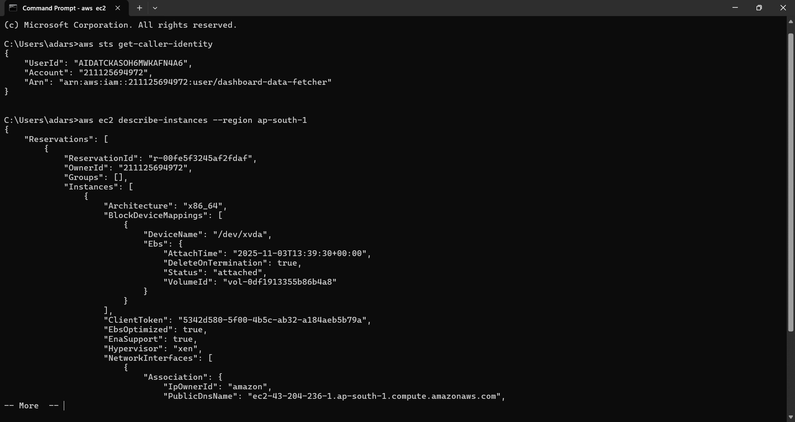

**10-S3-Bucket-Config**

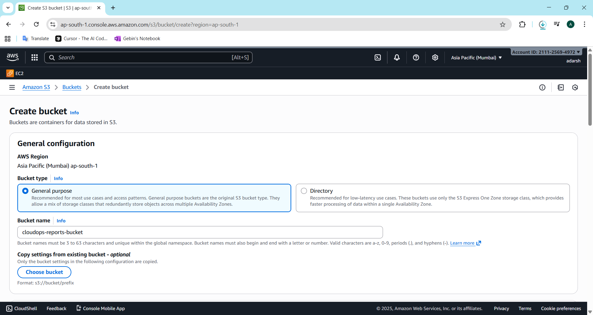

**11-S3-Bucket-List**

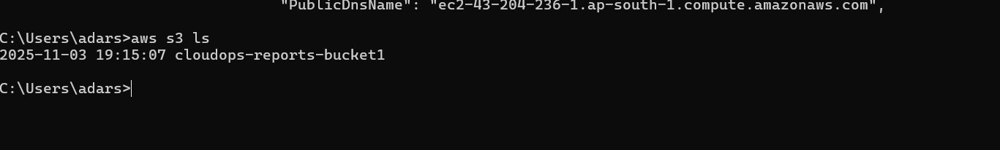

**12-IAM-Add-Permissions**

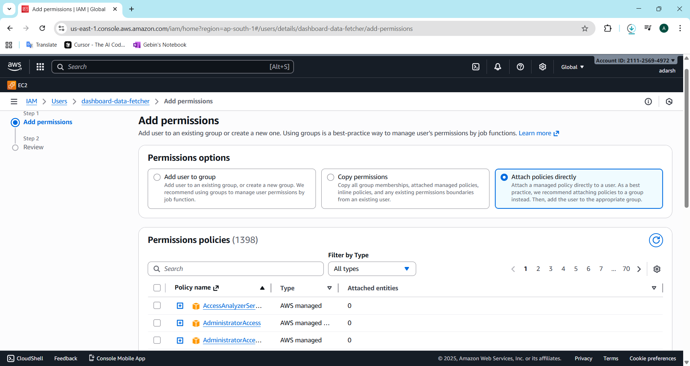

**13-IAM-S3FullAccess-Attached**

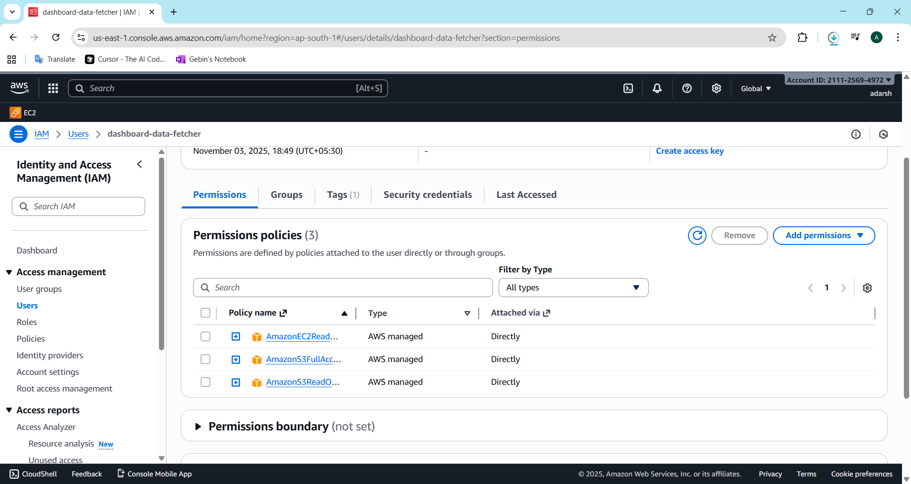

**14-S3-Upload-Success**

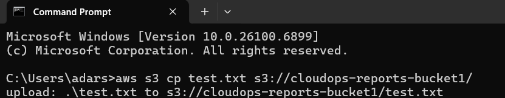

**15-S3-Bucket-File-List**

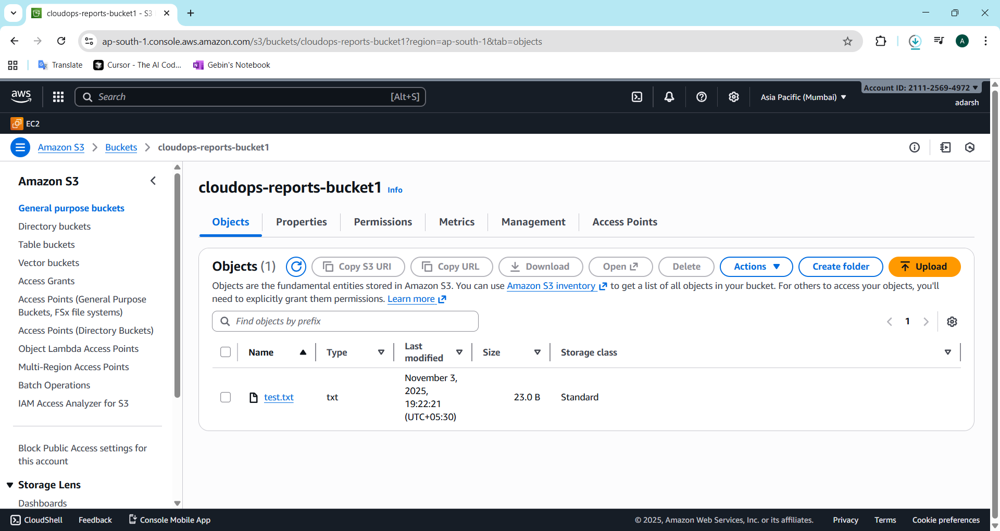

**16-Boto3-Installed**

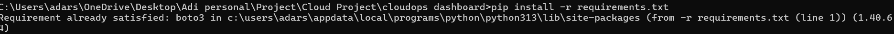

**17-Boto3-STS-Verified**

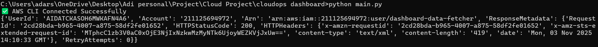

**18-EC2-Data-Fetched**

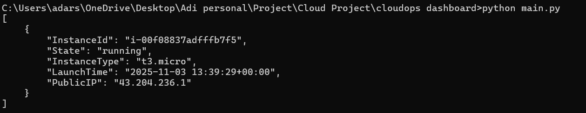

**19-EC2-Data-File**

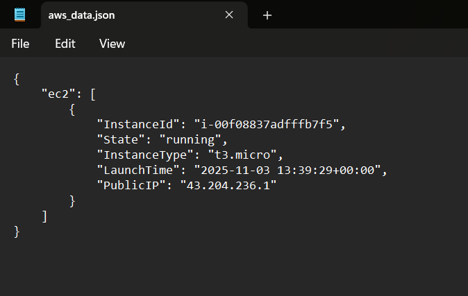

**20-AWS-Full-Data**

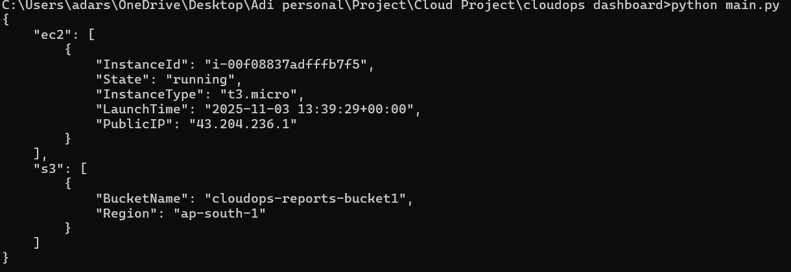

**21-AWS-Data-File**

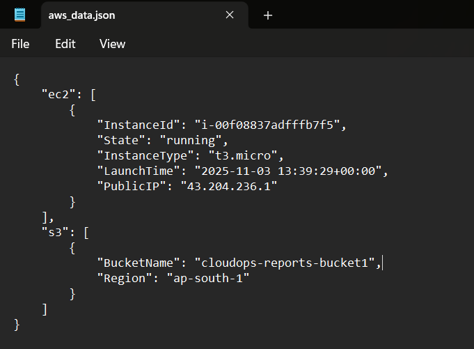

**22-Simulated-output**

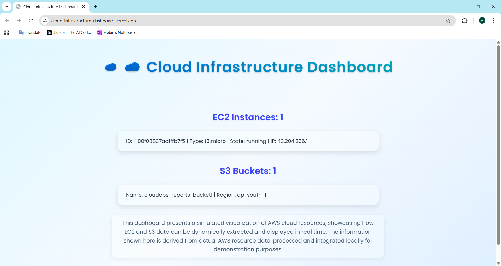

---
